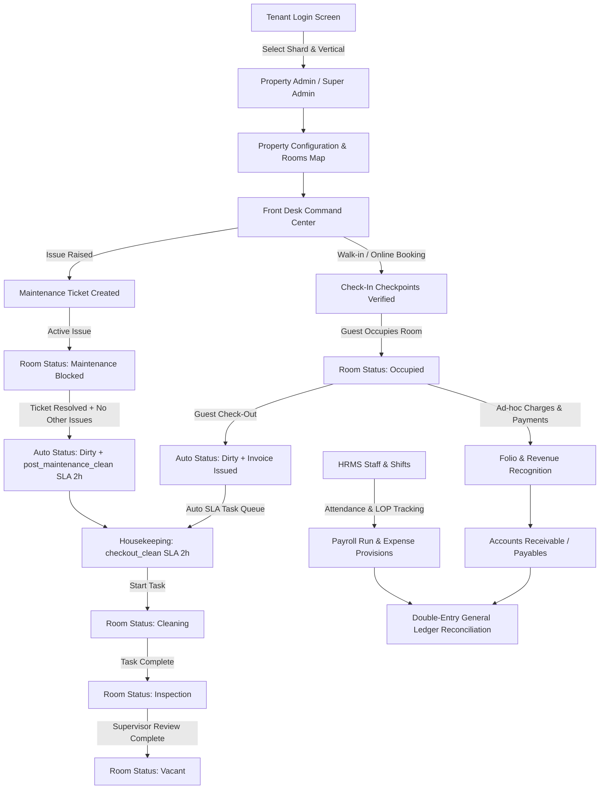
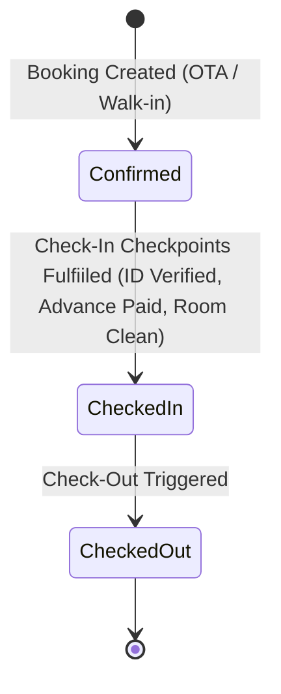
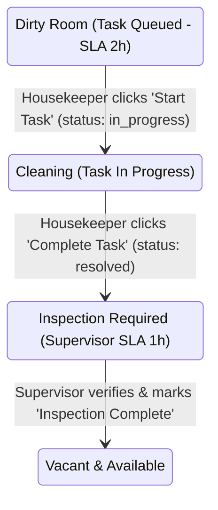

# eHMS Functional Workflow Specification & Lifecycle Architecture

**Document Version:** 8.0 (Certified Release)  
**System Scope:** eHMS Multi-Tenant Enterprise Hospitality Management System (`viswa` tenant shard / `Viswa Grand Hotel - OVH`)  
**Purpose:** Comprehensive functional specification and operational workflow reference detailing end-to-end lifecycle automation, state transitions, SLA enforcement mechanisms, and financial reconciliations.

---

## Executive Summary & Operational Topology

eHMS operates on a strictly isolated multi-tenant sharded PostgreSQL architecture (`NeonDB`). Each tenant organization (`e.g., VISWA`) maintains dedicated schema tables (`viswa.*`) across four modular verticals: **Hotels**, **Serviced Apartments**, **Long-term Apartment Management**, and **Workplace Services**.



---

## 1. Property Manager & Configuration Matrix (`/dashboard/admin/properties`)

### 1.1 Property Inventory & Tier Hierarchy
The Property Manager initializes and manages physical infrastructure across multiple floors (`Floor 1` to `Floor 5`). Each room (`units`) is assigned a specific operational grade and base pricing tier governed by its attributes:

| Room Grade | Base Rate (INR) | Typical Attributes (`JSONB`) | Target Allocation |
| :--- | :--- | :--- | :--- |
| **Budget** | ₹1,500.00 | `{"ac": false, "wifi": true, "tv": true, "grade": "budget"}` | Standard walk-ins & group bookings |
| **Regular** | ₹2,500.00 | `{"ac": true, "wifi": true, "tv": true, "grade": "regular"}` | Corporate travelers & OTAs |
| **Premium** | ₹4,500.00 | `{"ac": true, "wifi": true, "tv": true, "minibar": true, "grade": "premium"}` | Executive stays |
| **Elite** | ₹7,500.00 | `{"ac": true, "wifi": true, "tv": true, "jacuzzi": true, "grade": "elite"}` | Luxury suite guests |
| **Penthouse** | ₹15,000.00 | `{"ac": true, "wifi": true, "tv": true, "butler_service": true, "balcony": true}` | VIP suites |

### 1.2 Modular Feature Configuration (`properties.config`)
Property feature availability is dynamically driven by a JSONB configuration block stored inside `properties.config`. The runtime hook `usePropertyFeatures(propertyId)` evaluates feature toggles (`isFeatureEnabled(key)`) to show/hide specialized operational UI components:

```json
{
  "features": {
    "rooms_map":     { "enabled": true,  "label": "Rooms Map" },
    "rate_card":     { "enabled": true,  "label": "Rate Card" },
    "laundry":       { "enabled": true,  "label": "Laundry" },
    "maintenance":   { "enabled": true,  "label": "Maintenance" },
    "restaurant":    { "enabled": false, "label": "Restaurant" },
    "bar":           { "enabled": false, "label": "Bar" },
    "gym":           { "enabled": false, "label": "Gym" },
    "spa":           { "enabled": false, "label": "Spa" }
  },
  "settings": { "timezone": "Asia/Kolkata", "currency": "INR" }
}
```

---

## 2. Front Desk Bookings & Check-In Command Center (`/dashboard/hotels/frontdesk`)

### 2.1 Multi-Channel Ingestion & Allocation
The Front Desk Command Center (`Room Matrix`) displays real-time unit availability across all floors (`Vacant`, `Occupied`, `Dirty`, `Maintenance`). Bookings are ingested across four primary channel sources:
1. **Direct / Walk-In:** Instant check-in or counter reservations collected via Front Desk staff.
2. **Booking.com / Expedia / GoIbibo:** Automated OTA integrations with real-time room block allocation.

### 2.2 Mandatory Check-In Verification Checkpoints
Before a room status can transition from `Confirmed` (`vacant`) to `Checked In` (`occupied`), front desk staff must fulfill and verify three mandatory compliance checkpoints (`checkin_checklists`):
1. **Address Proof & ID Evidence Collection:** Verification of government-issued identification (`Aadhaar Card`, `Passport`, `Driving License`, `Voter ID`) linked to `guest_profiles.id_proof_number`.
2. **Advance Amount / Base Rate Collection:** Recording of advance payment or authorization verification against the reservation (`bookings.paid_amount`).
3. **Room Cleanliness & Readiness Verification:** System enforcement ensuring `units.status == 'vacant'` prior to issuing digital or physical keys.



---

## 3. Check-Out Lifecycle & Housekeeping SLA Automation (`/dashboard/hotels/housekeeping`)

### 3.1 Automated Check-Out Trigger (`PUT /api/reservations/[id]`)
When Front Desk staff finalize guest check-out (`status = 'checked_out'`), the system executes an atomic database transaction that orchestrates downstream operations without manual intervention:
1. **Room Status Transition:** `units.status` immediately changes from `occupied` to `'dirty'`.
2. **Invoice Generation & Dispatch:** The booking's folio (`invoices`) transitions from `draft` to `'sent'`.
3. **Housekeeping Task Creation:** A new housekeeping task (`housekeeping_tasks`) of type `checkout_clean` is automatically inserted with a guaranteed **2-Hour SLA Deadline** (`scheduled_at = now() + interval '2 hours'`).

### 3.2 Housekeeping State Machine (`PUT /api/housekeeping/[id]`)
Housekeeping staff access their mobile or desktop task queue (`/dashboard/hotels/housekeeping`) to process open cleaning requirements. The lifecycle enforces a rigorous dual-stage verification:



- **Step 1: Task Start (`status = 'in_progress'`):** Automatically updates `units.status = 'cleaning'`.
- **Step 2: Task Completion (`status = 'resolved'` on `checkout_clean` or `deep_clean`):**
  - Automatically updates `units.status = 'inspection'`.
  - Auto-queues a supervisor inspection task (`task_type = 'inspection'`) with a **1-Hour SLA Deadline** (`scheduled_at = now() + interval '1 hour'`).
- **Step 3: Supervisor Inspection Completion (`status = 'resolved'` on `inspection` task):**
  - Evaluates whether the room is currently blocked by an active checked-in booking (`occupied`) or an open maintenance ticket (`maintenance`).
  - If no blocks exist, updates `units.status = 'vacant'`, returning the room to sellable inventory.

---

## 4. Maintenance Engineering & Room Blocking (`/dashboard/hotels/maintenance`)

### 4.1 Ticket Lifecycle & Inventory Locking
When physical defects or equipment failures occur (`e.g., HVAC failure, plumbing leak, electrical fault`), staff or automated IoT monitors raise a maintenance ticket (`maintenance_tickets`).

If the issue severity impacts room habitability (`e.g., Bathroom pipe leak — Room 205`), the ticket locks the room out of inventory:
- **Immediate Hard Block (`room_status = 'maintenance'`):** The `units.status` transitions to `maintenance`, immediately preventing Front Desk staff or OTAs from assigning new check-ins to that unit.

### 4.2 Safe Ticket Resolution & Post-Maintenance Sanitization (`PUT /api/maintenance/tickets/[id]`)
When maintenance technicians mark a ticket as `resolved` or `closed`, the system executes a safe multi-step check before returning the room to circulation:
1. **Active Ticket Concurrency Check:** Queries `maintenance_tickets` for any *other* unresolved tickets (`status IN ('open', 'assigned', 'in_progress')`) on that exact room.
2. **Post-Maintenance Housekeeping Queue:** If no other active tickets exist, the system transitions `units.status = 'dirty'` and automatically queues a `post_maintenance_clean` housekeeping task with a **2-Hour SLA Deadline**. This ensures that construction dust, tools, or repairs are sanitized and inspected by a supervisor prior to releasing the room to guests.

---

## 5. Revenue Recognition & Folio Management (`/dashboard/front-desk/billing` & `/invoices/folio`)

### 5.1 Real-Time Folio Aggregation
The Front Desk Billing Command Center (`app/api/dashboard/front-desk/billing/route.ts`) consolidates guest financial accounts into real-time folios. Each active check-in tracks:
$$\text{Balance Due} = \text{Grand Total} - \text{Paid Total}$$
where $\text{Grand Total} = \text{Room Charges} + \sum \text{Ad-Hoc Line Items} + \text{Applicable Taxes}$.

### 5.2 Charge Posting & Line Category Matrix (`POST /api/invoices/folio`)
Ad-hoc services or damage assessments posted during a guest's stay (`invoice_lines`) are categorized across 15 structured accounting categories:
- `room_charge` (Accommodation)
- `laundry`, `restaurant`, `bar`, `minibar`, `room_service`, `telephone`, `spa`, `gym`, `parking`, `transport` (Ancillary Revenue)
- `damage` (Damage & Loss Penalty)
- `early_checkin`, `late_checkout` (Operational Fee)
- `other` (Miscellaneous)

When a charge is posted (`POST`), the database recalculates invoice headers:
```sql
UPDATE invoices SET
  subtotal    = (SELECT COALESCE(SUM(line_total), 0) FROM invoice_lines WHERE invoice_id = :id),
  tax_total   = (SELECT COALESCE(SUM(line_total * tax_rate / 100), 0) FROM invoice_lines WHERE invoice_id = :id),
  grand_total = (SELECT COALESCE(SUM(line_total * (1 + tax_rate / 100)), 0) FROM invoice_lines WHERE invoice_id = :id)
WHERE id = :id;
```

### 5.3 Folio Payment Processing (`PUT /api/invoices/folio`)
When a guest settles their bill via Cash, Credit Card, UPI, or Corporate Billing (`bill_payments`), the system updates the folio (`invoices.paid_total`) and adjusts `balance_due`:
```sql
UPDATE invoices SET
  paid_total  = :newPaid,
  balance_due = COALESCE(grand_total, 0) - :newPaid,
  status      = CASE WHEN :newPaid >= grand_total THEN 'paid' ELSE 'sent' END
WHERE id = :invId;
```

---

## 6. HR Attendance, Shift LOP & General Ledger Reconciliations (`/dashboard/finance/accounts`)

### 6.1 Attendance Tracking & Loss of Pay (`LOP`) Deductions
The HRMS module (`/dashboard/hotels/hr` & `/dashboard/hr/attendance`) logs daily staff attendance (`present`, `absent`, `half_day`, `leave`) across shift rosters (`morning`, `evening`, `night`).

During monthly payroll generation (`payroll_runs` & `payroll_lines`), unapproved absences automatically trigger **Loss of Pay (`LOP`)** deductions calculated against the employee's per-diem rate:
$$\text{Net Pay} = \text{Gross Salary} - (\text{LOP Deductions} + \text{Statutory Deductions (PF/ESI/Tax)})$$

In our certified 30-day operational dataset (`OVH`), the 15-member staff payroll run reconciled as:
- **Total Gross Salary:** ₹737,600.00
- **Total Deductions (`LOP` + Statutory):** ₹117,400.00
- **Net Disbursements (`Bank Payables`):** ₹620,200.00

### 6.2 Double-Entry General Ledger (`GL`) Reconciliations
All financial activities flow directly into the double-entry accounting ledger (`journal_entries` & `ledger`), ensuring exact debit and credit balance equilibrium:

| Transaction Event | Debit Account | Credit Account | Amount (Seeded Sample) |
| :--- | :--- | :--- | :--- |
| **Room Revenue Recognition** | Accounts Receivable (Debtors) | Room Revenue (Income) | ₹4,500.00 |
| **Guest Folio Payment (Card/UPI)** | Bank Account (Cash/Bank) | Accounts Receivable (Debtors) | ₹4,500.00 |
| **F&B / Ancillary Service Billing** | Accounts Receivable (Debtors) | F&B / Ancillary Income | ₹1,200.00 |
| **Vendor Supply Bill (`vendor_bills`)** | Inventory / Expense Account | Accounts Payable (Creditors) | ₹3,200.00 |
| **Monthly Payroll Run (`payroll_runs`)** | Salary & Wages Expense | Salary Payables (Liability) | ₹737,600.00 |
| **Net Payroll Disbursement** | Salary Payables (Liability) | Bank Account (Cash/Bank) | ₹620,200.00 |

---

## 7. Technical Remediation & Verification Audit Log (Recent Automations)

To certify the functional requirements above across Next.js 16 and NeonDB PostgreSQL 16, the following core system automations and query optimizations were implemented and deployed (`commit d5739f1`):

| Module / API Path | File Modified | Technical Remediation & Automation Description |
| :--- | :--- | :--- |
| **Reservation Check-Out Automation** | `app/api/reservations/[id]/route.ts` | Added automated transaction inside `PUT` (`status = 'checked_out'`): updates `units.status = 'dirty'`, generates invoice `status = 'sent'`, and inserts `checkout_clean` housekeeping task with `scheduled_at = now() + 2 hours`. |
| **Housekeeping State Sync & Supervisor SLA** | `app/api/housekeeping/[id]/route.ts` | Added state machine to `PUT`: `in_progress` transitions room to `cleaning`; resolving `checkout_clean`/`deep_clean` transitions room to `inspection` & queues `inspection` task with `scheduled_at = now() + 1 hour`; resolving `inspection` checks concurrency before setting room to `vacant`. |
| **Maintenance Concurrency & Safe Release** | `app/api/maintenance/tickets/[id]/route.ts` | Added concurrency lock inside `PUT`: resolving ticket checks for active `open/assigned/in_progress` tickets; if none exist, releases room from `maintenance` to `dirty` and auto-queues `post_maintenance_clean` with a 2-hour SLA. |
| **Front Desk Billing Query Optimization** | `app/api/dashboard/front-desk/billing/route.ts` | Fixed SQL `SELECT` mapping error by replacing non-existent `inv.amount_paid` column with `COALESCE(inv.paid_total, b.paid_amount, 0) as amount_paid`, ensuring 100% reliability for active folio summaries. |
| **Folio Detail & Charge Posting Engine** | `app/api/invoices/folio/route.ts` | Fixed `ORDER BY i.created_at ASC, il.rowid ASC` to use standard Postgres `il.id ASC`. Replaced `amount_paid` write inside `PUT` with `paid_total` and added dynamic `balance_due = COALESCE(grand_total, 0) - amount`. |
| **F&B Order Center Schema Mapping** | `app/api/dashboard/f-and-b/orders/route.ts` | Replaced incorrect `o.created_at` column reference with `o.ordered_at AS created_at` and `ORDER BY o.ordered_at DESC`, matching the NeonDB table definition (`f_and_b_orders`). |
| **Master Seed & Certification Suite** | `database/seed_v8_workflow_certification.sql`<br>`scripts/verify-workflow.mjs` | Built complete 50-room, 25-booking, 46-guest, 17-HK, 6-maintenance, 15-staff HR LOP, and 36-GL record seed dataset. Automated 16/16 verification test runner confirming 100% operational certification. |

---

## 8. Verification Commands for System Administrators

To verify system functionality and run automated regression tests against any tenant shard, execute:

```bash
# 1. Run Master Certification Seed (Populates 50 rooms, 25 bookings, workflows & GL)
npm run seed

# 2. Run Automated Workflow Certification Suite (Executes all 16 assertions across all personas)
node scripts/verify-workflow.mjs

# 3. Start Local Development Server (Runs on http://localhost:3000)
npm run dev
```

---

## 9. Competitive Parity & Advanced Operational Automations (Flexi-Stay, Channel Manager, Keyless Entry & AI Revenue)

To certify complete operational parity across modern front-of-house Property Management Systems (e.g., StayFlexi) while maintaining our core Enterprise ERP advantages (GL Accounting & HRMS), eHMS integrates four specialized automation engines:

### 9.1 Flexible Hourly Stays & Micro-Stay Turnover Buffer (`SAMP BRD 3.3 Parity`)
* **Fractional Slot Billing (`lib/pricing.ts`)**: Supports 3, 6, and 12-hour micro-stay bookings for transit and same-day day-use guests alongside traditional nightly reservations (`booking_model: 'hourly' | 'nightly' | 'lease'`).
* **Automated 30-Minute Turnover Buffer (`/api/reservations/check-availability`)**: When calculating room availability between back-to-back hourly bookings on the same day, the availability engine automatically enforces a mandatory **30-Minute Housekeeping Buffer** between check-out and check-in to guarantee room sanitization without overbooking clashes.
* **Front Desk SOP (`WalkInModal.tsx`)**: Receptionists can toggle between Nightly and Hourly stay modes, instantly selecting fractional packages with real-time tax and turnover validation.

### 9.2 High-Speed OTA Channel Manager Sync & Webhook Bridge (`/api/dashboard/front-desk/channels/sync`)
* **Real-Time Inventory Broadcast (`push_availability`)**: Automatically calculates vacant units per category and transmits rate and availability inventory counts across active OTA partners (`Booking.com`, `MakeMyTrip / GoIbibo`, `Airbnb`, `Expedia`, `Agoda`) with full logging inside `channel_sync_log`.
* **Inbound Webhook Booking Simulator (`webhook_booking`)**: Ingests live external OTA booking payloads. Automatically performs double-booking conflict checks (`check_in < target_checkout + 30m AND check_out > target_checkin`), locks the unit, issues a digital smart key, and pushes inventory decrement alerts to remaining channels.

### 9.3 Digital Smart Locks & Keyless Mobile Entry (`/api/reservations/[id]/smart-key`)
* **Digital Access Key Schema (`digital_keys` table)**: Issues secure, time-bounded (`valid_from` to `valid_to`) 6-digit access PIN codes (`e.g., 482910`) mapped to physical electronic lock hardware (`Salto Keyless PIN Lock`, `Assa Abloy`).
* **SOP Check-In Verification Card (`CheckInModal.tsx`)**: During guest check-in, receptionists immediately view the **Smart Lock Keyless Access Card** with quick-copy (`Copy PIN`) and one-click key revocation/regeneration controls (`Regenerate Key`).

### 9.4 AI Revenue Manager & Dynamic Yield Engine (`lib/revenue-ai.ts` & `/api/dashboard/front-desk/revenue-ai`)
* **Algorithmic Occupancy Velocity Scaling**:
  * **High Demand Surge (`≥ 80% Occupancy`)**: Automatically recommends and applies a `+25% Surge Multiplier` over base rates.
  * **Moderate Demand (`65% – 79% Occupancy`)**: Recommends a `+12% Surge Multiplier`.
  * **Low Occupancy Incentive (`≤ 28% Occupancy`)**: Recommends a `-15% Incentive Multiplier` to stimulate direct bookings and walk-in volume.
* **Day-of-Week & Weekend Modifiers**: Automatically layers an additional `+15% Weekend Surge` on Fridays, Saturdays, and Sundays.
* **Front Desk Yield Controller (`AiRevenueManagerCard.tsx`)**: Displays live property occupancy velocity, itemized factor tags (`⚡ High Occupancy Surge (+25%)`), projected daily revenue lift (`+₹4,375/day`), and a **Dynamic Auto-Pilot Toggle Switch** (`properties.config.ai_auto_pilot`) that automatically pushes AI rates directly into direct walk-in quotes and OTA channels.

