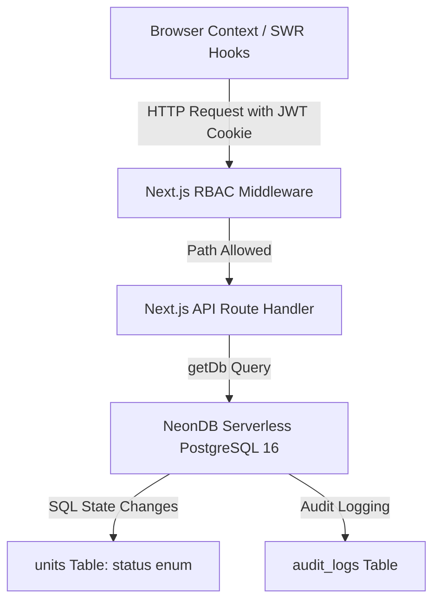
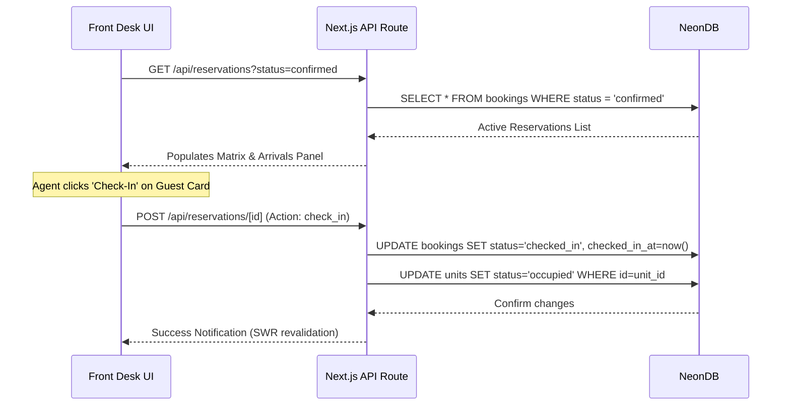
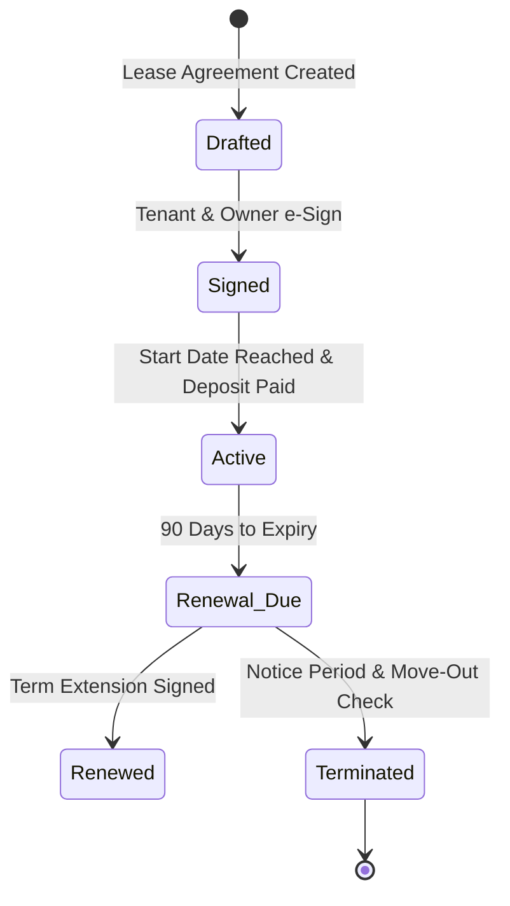
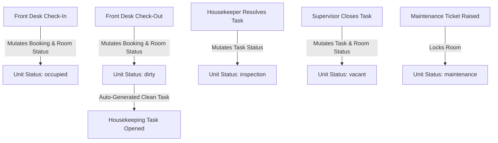

# eHMS — Expanded User Journeys & Application Features Reference

> **Enterprise Hospitality Management System**  
> Comprehensive mapping of application features, user interactions, database schemas, and API routers.

---

## 0. High-Level Domain & End-to-End Workflows

eHMS is built as a **Subscription-Based** platform serving four major property verticals:
1. **Hotels**
2. **Serviced Apartments**
3. **Apartment Management (Long-Term Rentals)**
4. **Workplace Services Management**

Regardless of the vertical, the system handles a cohesive end-to-end user journey:
1. **OTAs & Bookings:** Hospitality vendors/OTAs (e.g., MakeMyTrip, GoIbibo) and users trigger the lifecycle via advanced bookings or walk-ins. Features, service grades, and access levels are dictated by the booking price/tier.
2. **Visitor & Access Management:** From the moment a guest or tenant arrives, **Frontdesk** and visitor management systems track their presence.
3. **Facilities Operations:** A booked room/desk instantly activates downstream workflows for **Facilities Administrators**, **Housekeeping** (cleaning routes), and **Maintenance** (vendor availability and preventive repair planning).
4. **Back-Office Integration:** The operations directly interface with **HR Processes** (Employee Attendance, Shift rotations, Payroll logic) and **Finance Workflows** (Invoicing, Ledger, Payments, Subscriptions).

---

## 1. Architectural & Database Foundation

The eHMS application operates on a unified, multi-vertical architecture designed to support star hotels, serviced apartments, long-term rental tenancies, and managed workplaces. This unified approach uses a single client session, controlled via a secure `ehms_token` cookie, which maps back to the database tables to govern data visibility and mutation limits.



### Core Global State & Auto-Sync Engine
Many journeys dynamically update the status of resources in the `units` table (`status` column of type `room_status` enum). The system operates an **auto-sync trigger engine** that maintains state consistency:

| User Action | Target DB Table | Field Modifications | Target Unit Status |
| :--- | :--- | :--- | :--- |
| **Guest Check-In** | `bookings` | `status = 'checked_in'`, `checked_in_at = now()` | `occupied` |
| **Guest Check-Out** | `bookings` | `status = 'checked_out'`, `checked_out_at = now()` | `dirty` |
| **Housekeeper Clean Done**| `housekeeping_tasks` | `status = 'resolved'`, `completed_at = now()` | `inspection` |
| **Supervisor Sign-Off** | `housekeeping_tasks` | `status = 'closed'` | `vacant` |
| **Maintenance Ticket Opened** | `maintenance_tickets`| `status = 'open'` or `'assigned'` | `maintenance` |
| **Maintenance Closed** | `maintenance_tickets`| `status = 'closed'`, `resolved_at = now()` | `vacant` (or trigger cleaning if dirty) |

---

## 2. Expanded User Journeys (By Role)

### J1: Front Desk Agent — Check-In, Matrix Control & Room Transfer
* **Role/Persona**: Front Desk Agent (`front_desk`) or Hotel Manager (`property_manager`).
* **Daily Mission**: Manage check-ins, check-outs, coordinate reservations, issue keys, process payments, and ensure guests have a seamless welcome.
* **Access Scope**: Limited to `/dashboard` and `/dashboard/front-desk`.



#### Detailed Workflow & UI Features
1. **Interactive Room Matrix**:
   - Displays a grid layout of all rooms grouped by floor (1st Floor, 2nd Floor, etc.).
   - Visual status color codes: 
     - 🟢 **Vacant & Ready** (`vacant` / `#2BAE8E`)
     - 🔵 **Occupied** (`occupied` / `#1A3C5E`)
     - 🟡 **Dirty** (`dirty` / `#F5A623`)
     - 🟠 **Out of Order / Maintenance** (`maintenance` / `#E53E3E`)
     - ⚪ **Reserved** (`reserved` / `#64748B`)
   - Supports room hovering to inspect guest name, ETA, and balance.
2. **Arrivals Panel**:
   - List of guests arriving today. Clickable **Check-In** button triggering a pop-up checklist.
   - Checklist items: verify ID (Passport/Aadhaar OCR validation), collect security deposit, verify payment details.
3. **Departures Panel**:
   - List of in-house guests due to leave today. Clickable **Check-Out** button calculating real-time balance.
   - Shows split-billing choices and a quick payment collection dialog.
4. **Room Transfer (Drag & Drop)**:
   - Drag a booking tile from one room to another.
   - Pops up confirmation comparing room categories and pricing differences.
   - Triggering a room transfer updates `bookings.unit_id` and restores the old unit to `dirty` while updating the new unit to `occupied`.

#### Client Hooks & API Integrations
- **SWR Hook**: `useReservations(filters)` fetched from `/api/reservations`.
- **Mutation Hook**: `useCheckIn()` targeting `/api/reservations/[id]`.
- **Mutation Hook**: `useCheckOut()` targeting `/api/reservations/[id]`.
- **Database Tables**:
  - `bookings` (Mutates: `status`, `checked_in_at`, `checked_out_at`, `paid_amount`, `unit_id`).
  - `units` (Mutates: `status`).
  - `guest_profiles` (Reads: KYC status).

---

### J2: Housekeeping Staff & Supervisor — Smart Clean & Quality Checklist
* **Role/Persona**: Housekeeping Staff (`housekeeping_staff`) or Supervisor (`housekeeping_supervisor`).
* **Daily Mission**: Clean vacant dirty rooms, log linen usage, perform quality checks, and change room status to ready.
* **Access Scope**: Limited to `/dashboard` and `/dashboard/housekeeping`.

#### Detailed Workflow & UI Features
1. **Priority Task List**:
   - Geolocated or floor-sorted list of cleaning tasks.
   - Sorted by critical priorities:
     - ⚡ **VIP Check-In Scheduled** (High Priority)
     - ⚡ **Departure Clean** (Turnaround)
     - ⚡ **Stayover Tidy** (Daily cleaning for current guests)
2. **Cleaning Protocol Checklists**:
   - Tapping a task opens the protocol list (e.g., "Change bed linens", "Sanitize bathroom", "Replenish toiletries").
   - Housekeeper marks each item completed in the UI before they can tap "Submit Clean".
3. **Linen Ledger Integration**:
   - Scanner widget to log linen transactions. Housekeeper inputs batch numbers and stage updates (e.g., dispatching 4 soiled bedsheets, collecting 4 fresh pillowcases).
4. **Supervisor Inspection Queue**:
   - When staff marks a room "Cleaned", it is routed to the Supervisor's "Inspection Queue".
   - The supervisor inspects the room, reviews the checklist, and marks it "Pass" (which changes `units.status` to `vacant` and closes the task) or "Fail" (routes task back to staff with notes).

```
[Vacant Dirty Unit] ──(Staff starts task)──► [Status: Cleaning]
                                                   │
                                            (Staff completes)
                                                   │
                                                   ▼
[Vacant Ready Unit] ◄──(Superv. approves)── [Status: Inspection]
```

#### Client Hooks & API Integrations
- **SWR Hook**: `useHousekeeping(filters)` fetched from `/api/housekeeping` (polling every 15s for real-time dispatching).
- **Mutation Hook**: `useUpdateHousekeepingTask()` targeting `/api/housekeeping/[id]`.
- **Mutation Hook**: `useCreateHousekeepingTask()` targeting `/api/housekeeping` (Supervisor assigning ad-hoc tasks).
- **Database Tables**:
  - `housekeeping_tasks` (Mutates: `status`, `assigned_to`, `started_at`, `completed_at`, `notes`).
  - `housekeeping_checklists` (Mutates: `is_checked`, `checked_at`, `checked_by`).
  - `linen_batches` & `linen_transactions` (Logs inventory movements).
  - `units` (Syncs status to `cleaning`, `inspection`, or `vacant`).

---

### J3: Maintenance Engineer — Corrective Repairs & AMC Preventative Schedule
* **Role/Persona**: Maintenance Staff (`maintenance_staff`) or Maintenance Supervisor.
* **Daily Mission**: Respond to corrective work orders, manage spare parts inventory, monitor AMC contracts, and complete recurring preventive maintenance schedules.
* **Access Scope**: Limited to `/dashboard` and `/dashboard/maintenance`.

#### Detailed Workflow & UI Features
1. **Maintenance Ticket Board**:
   - Interactive list of open tickets categorized by priority (Critical, Medium, Low).
   - Critical issues (e.g., AC Failure, Water Leak, Lock Malfunction) are highlighted in red.
2. **Preventative Maintenance Schedule**:
   - List of recurring checklists based on asset cycles (e.g., "90-Day AC Filter Service", "Annual Elevator Safety Test").
   - Shows next due date and highlights overdue checks.
3. **AMC (Annual Maintenance Contract) Lookup**:
   - When a ticket is opened for a registered asset (e.g., Otis Elevator, Daikin VRV AC), the system auto-queries the `amc_contracts` table.
   - If covered under an active contract, a badge displays **"Under AMC - Route to Vendor"** and auto-suggests creating a Vendor Service Request instead of assigning internal staff.
4. **Parts & Cost Logging**:
   - Engineers can log spare parts used (e.g., LED Bulb, Flush Valve) which subtracts quantities from `parts_inventory`.
   - Fields for entering external labor costs, automatically computing `total_cost`.

#### Client Hooks & API Integrations
- **SWR Hook**: `useMaintenance(filters)` fetched from `/api/maintenance`.
- **Mutation Hook**: `useCreateMaintenanceTicket()` targeting `/api/maintenance`.
- **Database Tables**:
  - `maintenance_tickets` (Mutates: `status`, `assigned_to`, `cost_parts`, `cost_labor`, `resolved_at`, `resolution_notes`).
  - `asset_register` (Reads: serial number, warranty expiry, status).
  - `amc_contracts` (Reads: validity dates, vendor links).
  - `parts_inventory` (Mutates: `quantity_in_stock`).
  - `units` (Auto-locks unit status to `maintenance` when a ticket is opened, restores status when resolved).

---

### J4: Finance Manager — General Ledger, Invoices & Bank Reconciliation
* **Role/Persona**: Finance Manager (`finance_manager`) or Accountant.
* **Daily Mission**: Audit property billing, track revenue, review invoice payments, reconcile bank statement transactions, and check profit and loss reports.
* **Access Scope**: Limited to `/dashboard` and `/dashboard/finance`.

#### Detailed Workflow & UI Features
1. **P&L (Profit and Loss) Trends**:
   - Graph displaying Monthly Revenue vs Expenditures.
   - Shows breakdowns by revenue vertical: Nightly bookings (Hotels), Monthly leases (Apartment rentals), Workspaces (Desks/Meeting rooms), and Ancillaries (F&B/Amenities).
2. **Invoice Ledger Table**:
   - Interactive table showing all invoices with status tags (Draft, Sent, Paid, Overdue, Cancelled).
   - Allows searching by guest name, invoice number, or property code.
3. **One-Click Bank Reconciliation Panel**:
   - Two-column dashboard matching. Left Column: Statement transactions uploaded from bank API (`bank_reconciliation` table). Right Column: Logged system invoice payments (`payments` table).
   - The engine auto-suggests matches based on exact amount, date, and reference tags. User clicks "Confirm Match" to reconcile, marking payments as `reconciliation_status = 'matched'`.
4. **Tax Ledger**:
   - Calculates real-time GST/VAT liabilities based on invoices generated.

```
Bank Statement Row:  "CR 19-Jun-2026: INR 45,000" (Ref: EHMS-10492)
System Payment Row:  "INR 45,000 received from Guest John Smith" (Inv: 10492)
                     └────► [Auto-Match Suggestion] ────► [Reconciled ✔]
```

#### Client Hooks & API Integrations
- **SWR Hook**: `useFinance(propertyId)` fetched from `/api/finance`.
- **Database Tables**:
  - `invoices` & `invoice_lines` (Reads/Mutates: billing records).
  - `payments` (Mutates: `reconciliation_status`, `status`).
  - `bank_reconciliation` (Mutates: `status`, `matched_payment_id`, `reconciled_at`).
  - `chart_of_accounts`, `journal_entries` & `journal_lines` (Double-entry transaction mapping).

---

### J5: HR Manager — Staff Rostering, Shift Rotations & Payroll Runs
* **Role/Persona**: HR Manager (`hr_manager`).
* **Daily Mission**: Manage employee directory, plan weekly shifts, track attendance with geofenced clock-ins, compute monthly payroll, and ensure labor compliance.
* **Access Scope**: Limited to `/dashboard` and `/dashboard/hr`.

#### Detailed Workflow & UI Features
1. **Employee Directory**:
   - Employee profiles showing designation, department, base salary, bank details, and active status.
2. **Shift Roster & Calendar**:
   - Visual scheduling board mapping employees to shift rotations (e.g., Morning Shift: 06:00 - 14:00, Night Shift: 22:00 - 06:00).
   - Identifies schedule conflicts (e.g., employees scheduled back-to-back without rest).
3. **Attendance & Geofencing Monitor**:
   - Lists daily logs showing clock-in/out times, facial authentication checks, and GPS compliance.
   - Highlights out-of-boundary geofenced flags if a housekeeper clocks in away from property coordinates.
4. **Automated Payroll Run**:
   - Computes salary details for a specific month.
   - Automatically calculates deductions (Provident Fund/PF, Employee State Insurance/ESI, Professional Tax/PT, Tax Deducted at Source/TDS) based on rules stored in the database.
   - Displays gross-to-net calculations for review before approval.

#### Client Hooks & API Integrations
- **SWR Hook**: `useEmployees(search)` fetched from `/api/hr/employees`.
- **Database Tables**:
  - `employees` (Reads: base salary, bank codes).
  - `attendance_records` (Calculates: payable days, overtime hours).
  - `payroll_runs` (Mutates: `status`, `total_gross`, `total_net`, `approved_by`).
  - `payroll_lines` (Computes: detailed deduction breakdowns per worker).
  - `shift_rotations` (Manages schedules).

---

### J6: Property Manager — Yield Control & Compliance Vault
* **Role/Persona**: Property Manager (`property_manager`) or Operations Director.
* **Daily Mission**: Monitor property performance, manage occupancy rate plans, track vendor SLAs, and track compliance certificates.
* **Access Scope**: `/dashboard`, `/dashboard/hotels`, `/dashboard/apartments`, `/dashboard/rental`, `/dashboard/workplace`, and `/dashboard/admin`.

#### Detailed Workflow & UI Features
1. **Multi-Vertical Dashboard**:
   - Shows key metrics aggregated by vertical (Star Rating, Revenue, Occupancy, Active listings).
   - Allows switching view configs between hotels, serviced apartments, long-term rentals, and workplaces.
2. **Yield & Rate Plan Editor**:
   - Allows setting base rates for rooms/suites and activating dynamic pricing rules (e.g., "Increase price by 20% if occupancy exceeds 85%").
3. **Compliance Vault**:
   - A secure vault tracking regulatory records (e.g., Fire Safety Permit, Liquor License, Pollution NOC, GST registration).
   - Highlight alerts for certificates expiring within 90 days. Documents can be viewed directly in the browser via file storage links.
4. **Vendor Orders Review**:
   - Reviews vendor Purchase Orders (PO), delivery schedules, and SLAs.

#### Client Hooks & API Integrations
- **SWR Hook**: `useProperties(vertical)` fetched from `/api/properties`.
- **Database Tables**:
  - `properties` (Reads: metadata, config, location coordinates).
  - `compliance_records` (Mutates: active licenses, uploaded document URLs, expiry dates).
  - `rate_plans` (Mutates: base rates, dynamic pricing rules).
  - `buildings` & `floors` (Manage space hierarchy).

---

### J7: Apartment Tenant — Tenant Lease Lifecycle & Rent Ledger
* **Role/Persona**: Tenant (`tenant` via resident portal) or Property Manager (`property_manager`).
* **Daily Mission**: Guide a tenant from lease application through automated monthly rent invoices to the eventual move-out inspection.
* **Access Scope**: `/dashboard/rental` (for Managers), Tenant App (for Tenants).



#### Detailed Workflow & UI Features
1. **Lease Workbench**:
   - Tracks agreement state machines: `drafted` ➔ `signed` ➔ `active` ➔ `renewal_due` ➔ `terminated`.
   - Links to digital e-signatures (`signed_by_tenant`, `signed_by_owner`).
2. **Rent Invoicing and Ledger**:
   - Auto-generates monthly rent invoices on a schedule (e.g., 1st of every month).
   - Integrates late fee calculations if unpaid after due date.
   - Tracks deposit ledger accounts (`deposit_ledger`) including initial receipt, maintenance deductions, and final refunds.
3. **Service Requests Panel**:
   - Tenants can log maintenance requests (e.g., plumbing leak, electrical failure).
   - These are routed into the global maintenance engine for dispatching.
4. **Move-Out Checklist**:
   - When a tenant files a move-out notice, a checklist is auto-generated (e.g., "Check walls for paint damage", "Verify kitchen appliance condition").
   - Inspectors use this checklists during inspections to record conditions and upload photos, resolving refund calculations.

#### Client Hooks & API Integrations
- **SWR Hook**: `useLeases(filters)` fetched from `/api/leases`.
- **Database Tables**:
  - `lease_agreements` (Mutates: `status`, `start_date`, `end_date`, `rent_amount`, `e_signature_url`).
  - `rent_invoices` (Auto-created: `rent_amount`, `late_fee`, `status`).
  - `deposit_ledger` (Logs payments and refunds).
  - `move_out_checklist` (Records verified items and conditions).

---

### J8: Workplace Member — Desk Booking, Meeting Rooms & Access Keys
* **Role/Persona**: Coworking Member/Guest (`guest_profiles`) or Workspace Facility Manager.
* **Daily Mission**: Select desk bookings, schedule team meeting rooms, register guests, and handle access keys.
* **Access Scope**: `/dashboard/workplace` (for Managers), Coworking Member App (for Members).

#### Detailed Workflow & UI Features
1. **Interactive Floor Plan Grid**:
   - SVG map displaying co-working spaces (Hot Desks, Dedicated Desks, Meeting Rooms, Private Cabins).
   - Colour-coded availability indicators (Green: Available, Red: Booked/Occupied).
   - Click to select and reserve a seat.
2. **Meeting Room Scheduler**:
   - Calendar view showing available time slots.
   - Includes conflict detection preventing double-booking slots.
   - Auto-syncs with corporate Outlook or Google Calendars.
3. **Visitor Pre-Registration**:
   - Members register visitors (name, purpose, check-in time).
   - Generates digital QR gate badges that auto-expire after the scheduled visit.
4. **Corporate Membership Ledger**:
   - Shows active membership tiers (Hot Desk Pool, Private Office).
   - Tracks seat allocation vs actual usage to prevent plan overages.

#### Client Hooks & API Integrations
- **SWR Hook**: `useWorkplace()` fetched from `/api/workplace`.
- **Database Tables**:
  - `workplace_bookings` (Mutates: `unit_id`, `booking_type`, `start_time`, `end_time`, `status`).
  - `membership_plans` (Reads: price, seat pool, allowed hours).
  - `corporate_memberships` (Mutates: `seat_used`).
  - `visitor_logs` (Mutates: `visitor_name`, `check_in`, `check_out`, `badge_issued`).

---

### J9: Super Admin — System Configuration, Role Management & Audit Vault
* **Role/Persona**: Super Admin (`super_admin`).
* **Daily Mission**: Manage user accounts, assign database roles, review activity audit trails, and maintain integrations.
* **Access Scope**: Complete platform access, including `/dashboard/admin`.

#### Detailed Workflow & UI Features
1. **User Accounts Panel**:
   - Central control to activate, suspend, or create user profiles.
   - Toggle Multi-Factor Authentication (MFA) requirements across roles.
2. **RBAC Rule Console**:
   - Assign roles mapped to specific property boundaries.
   - Assign global roles (e.g., Executive) or property-specific roles (e.g., Front Desk Agent at Chennai Oceanview Hotel).
3. **System Audit Logs**:
   - Tab showing platform audit trails.
   - Tracks details: who executed an action, which entity changed (e.g., `booking`), what columns updated, IP address, and browser fingerprint.
   - Search logs by user ID or entity ID.
4. **Backup & Key Vault**:
   - Manage external API secrets (Neon connection strings, Vercel endpoints, SMS gateways).

#### Client Hooks & API Integrations
- **API Endpoint**: `/api/auth/me` and `/api/admin` actions.
- **Database Tables**:
  - `users` (Mutates: `is_active`, `password_hash`, `mfa_enabled`).
  - `user_roles` (Mutates: roles linked to properties).
  - `audit_logs` (Reads activity records).
  - `properties` & `regions` (Add new locations).

---

### J10: Executive — Macro-Portfolio Analytics & Capital Expenditures
* **Role/Persona**: Corporate Executive (`executive`).
* **Daily Mission**: Monitor performance indicators, review portfolio yields, and approve capital expenditures (CapEx).
* **Access Scope**: Read-only strategic access to all dashboard modules.

#### Detailed Workflow & UI Features
1. **Macro-Analytics View**:
   - Summarizes overall portfolio yield metrics (Occupancy %, Average Daily Rate / ADR, Revenue Per Available Room / RevPAR, Net Profit).
   - Compares performance metrics side-by-side across hotels, apartments, and co-working spaces.
2. **CapEx Approval Module**:
   - Reviews pending expenses exceeding operational limits (e.g., HVAC replacement quote from maintenance department).
   - Action buttons: "Approve" (releases PO, changes budget status) or "Reject" (sends back for updates).
3. **Compliance Review Board**:
   - Shows active legal flags or property compliance risks across regions.

#### Client Hooks & API Integrations
- **SWR Hook**: `useStats()` fetched from `/api/dashboard/stats` (auto-refreshing every 30 seconds).
- **Database Tables**:
  - `bookings`, `payments`, `units`, `guest_profiles` (Aggregates performance statistics).
  - `maintenance_tickets` & `amc_contracts` (Review high-cost tickets).
  - `compliance_records` (Monitor legal compliance).

---

## 3. Global Data Sync & Event Mapping Matrix

The state changes in the system trigger automatic actions across departments. The matrix below shows how actions in one module update the database state and affect other journeys:



### State Propagation Reference Table

| Triggers / Source Event | SQL Action | DB Table Updated | Secondary Effects / Automated Actions |
| :--- | :--- | :--- | :--- |
| **Check-In Guest** | `UPDATE bookings SET status = 'checked_in'` | `bookings`, `units` | Room is marked `occupied`. Housekeeping checks are locked out for this unit. |
| **Check-Out Guest** | `UPDATE bookings SET status = 'checked_out'` | `bookings`, `units` | Room is marked `dirty`. A housekeeping task of type `turnaround` is auto-created. |
| **Task Completed** | `UPDATE housekeeping_tasks SET status = 'resolved'` | `housekeeping_tasks`, `units` | Room status becomes `inspection`. Supervisor is notified via the inspection queue. |
| **Inspection Pass** | `UPDATE housekeeping_tasks SET status = 'closed'` | `housekeeping_tasks`, `units` | Room status becomes `vacant` (Ready for next check-in). |
| **Open Repair Ticket**| `INSERT INTO maintenance_tickets` | `maintenance_tickets`, `units` | Room is locked as `maintenance`. Current bookings are flagged for reassignment. |
| **Resolve Repair** | `UPDATE maintenance_tickets SET status = 'resolved'` | `maintenance_tickets`, `units` | Room is set to `dirty` to prompt cleanup before bookings resume. |
| **Sign Lease** | `UPDATE lease_agreements SET status = 'active'` | `lease_agreements`, `units` | Apartment unit is locked as `occupied` (nightly reservation availability is blocked). |
| **Rent Overdue** | `UPDATE rent_invoices SET status = 'overdue'` | `rent_invoices` | Automatically issues email/SMS alerts. Overdue rent is flagged on the tenant portal. |
| **Visitor Entry** | `INSERT INTO visitor_logs` | `visitor_logs` | Sends WhatsApp check-in alert to host employee. |

---

## 4. Security & RBAC Guardrails

### 1. Token Handling and Verification
Authentication uses an HTTP-Only cookie `ehms_token` to protect sessions from Cross-Site Scripting (XSS) extraction.
- **Middleware Guard**: `middleware.ts` intercepting `/dashboard/*` calls `proxy.ts`. It verifies the JWT signature and extracts user metadata (e.g. `role_name`, `email`).
- **Route Validation**: API routes call `hasAccess(user.role_name, req.pathname)` before querying the database. If validation fails, it returns a `403 Forbidden` response.

### 2. Parameterized Queries (SQL Injection Guard)
All database interactions use parameterized SQL arrays via Neon's query library, avoiding direct string interpolation:

```typescript
// SECURE: Parameterized inputs via template literal syntax
const db = getDb();
const result = await db`
  SELECT * FROM bookings 
  WHERE property_id = ${propertyId} 
    AND status = ${status}
`;
```

### 3. Audit Logging Integration
Mutating API requests (POST/PUT/DELETE) write audit trails to the `audit_logs` table:
```sql
INSERT INTO audit_logs (user_id, action, entity_type, entity_id, old_state, new_state, ip_address)
VALUES ($1, $2, $3, $4, $5, $6, $7);
```

---

*Document: eHMS Expanded User Journeys & Features · Version 2.0 · Reference for Development and Testing*
